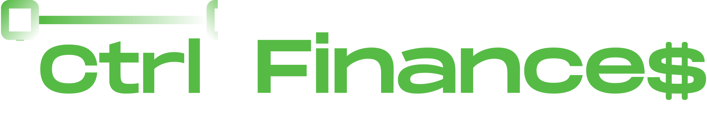
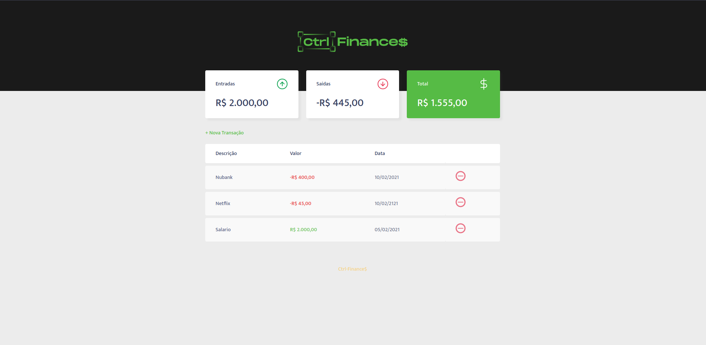

<h1 align="center">
    
</h1>

 

  

## 💻 Projeto

Ctrl-Finance$ é um projeto de Controle/Balanço patrimonial, desenvolvido junto a comunidade da Rocketseat, em uma maratona de cursos voltados para o desenvolvimento front-end.

  

## Licença

Esse projeto está sob a licença MIT. Veja o arquivo [LICENSE](LICENSE.md) para mais detalhes.
